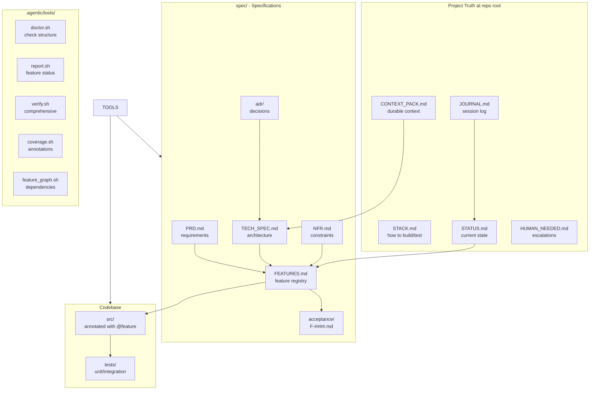
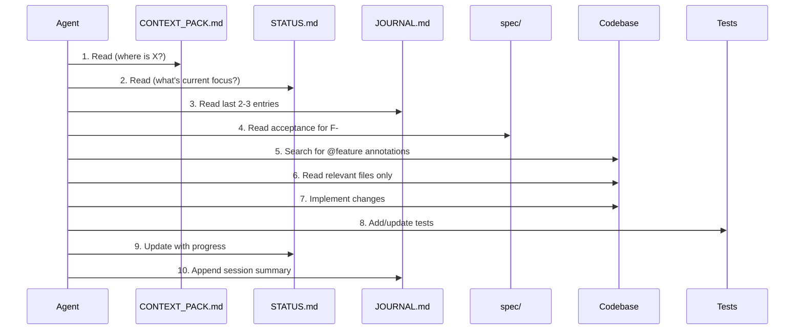
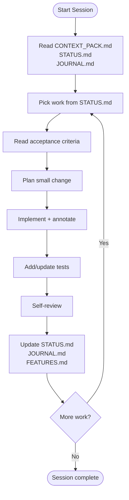
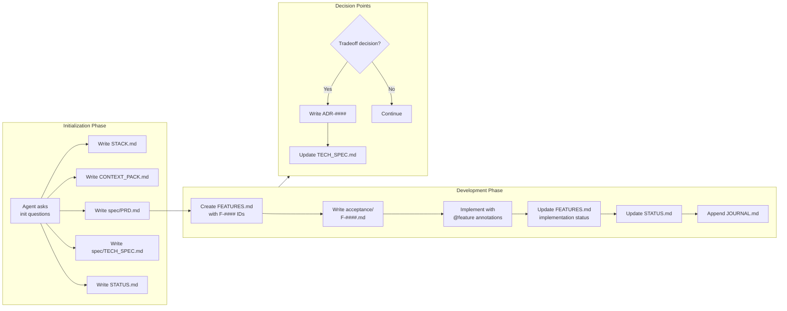
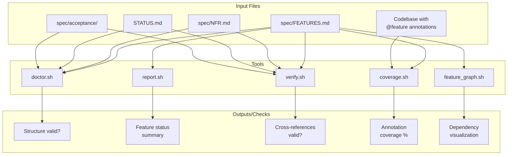
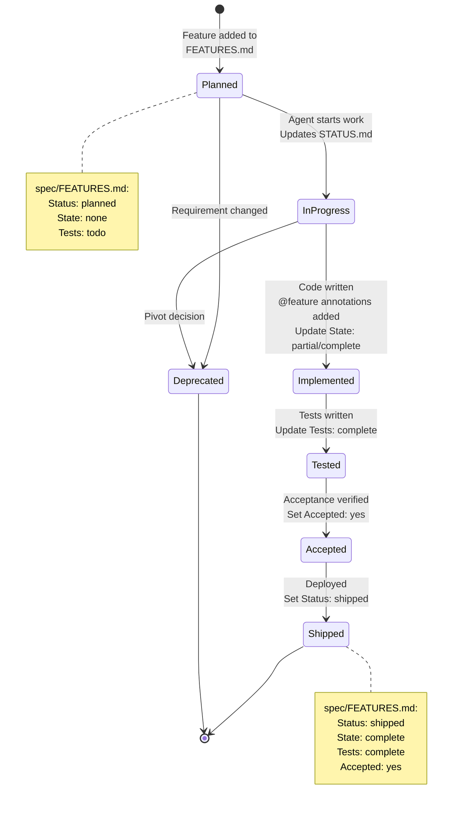
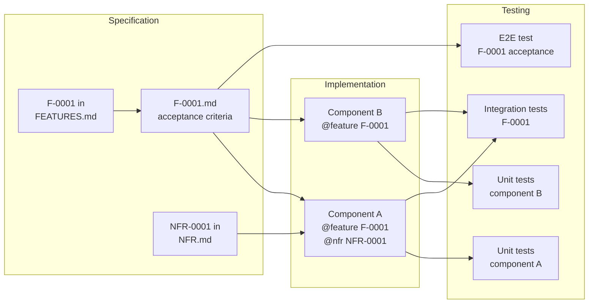
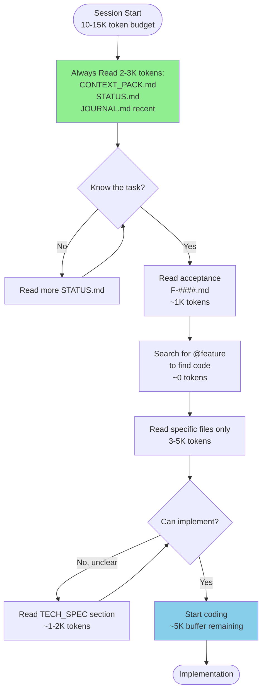
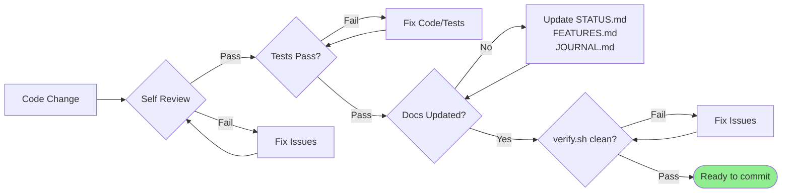
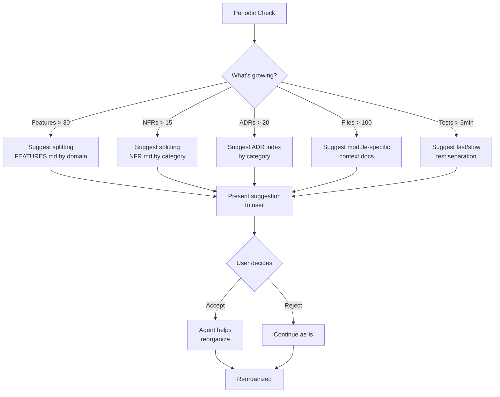

# Framework Map: Visual Guide

This document shows how all parts of the agentic framework fit together.

## High-level relationships

---

## Agent workflow (session start to implementation)

---

## Development loop

---

## Document lifecycle and dependencies

---

## Tool dependencies

---

## Feature lifecycle

---

## Information flow: Specs → Code → Tests

---

## Token efficiency strategy

---

## Quality gates

---

## Scaling thresholds (when to reorganize)

---

## Legend

**Colors in diagrams:**
- Green: Success/completion states
- Blue: Active work/implementation
- Yellow/Orange: Decision points
- Gray: Normal states

**Arrow types:**
- Solid arrow (→): Direct dependency or flow
- Dotted arrow (⋯→): Optional or conditional relationship

**Box types:**
- Rectangle: Process or file
- Diamond: Decision point
- Rounded rectangle: Start/end states
- Cylinder: Database or persistent storage

---

## Quick navigation

- **New to framework?** Start at [`START_HERE.md`](START_HERE.md)
- **Need specific docs?** See START_HERE document index
- **Want workflows?** See [`workflows/`](workflows/) directory
- **Need tools help?** See [`tools/`](tools/) directory with .sh scripts

