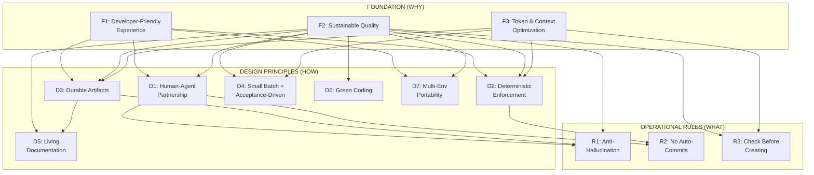

# Framework Principles

**Purpose**: Core values and principles that guide the Agentic AI Framework. Every design decision traces back to these principles.

**For New Contributors**: Understand these before proposing changes. **For Agents**: These are non-negotiable guidance.

**Structure**: 3 FOUNDATION + 7 DESIGN PRINCIPLES + 3 OPERATIONAL RULES (13 total). All are mandatory. The tier distinction is abstraction level (WHY → HOW → WHAT), not enforcement level. When principles conflict, specificity wins: Rules override Design Principles for concrete situations.

---

## Guiding Meta-Principle: KISS (Keep It Simple)

Every decision — feature design, documentation, tooling, agent instructions — should favor the simplest approach that works. Complexity is the enemy of reliability, especially with AI agents. If a solution requires lengthy explanation, it's probably too complex. Simpler frameworks get followed; complex ones get ignored.

**Apply everywhere**: When adding a principle, feature, or tool — ask "is this the simplest way?" When reviewing — ask "can this be simpler?" When choosing between two approaches — pick the one easier to understand and maintain.

---

## Derivation Hierarchy

Every non-foundation principle traces back to one or more parent principles, forming a directed acyclic graph (DAG). This makes the reasoning visible: you can trace any rule back to the foundational WHY it exists.

---

## FOUNDATION (WHY — the reasons this framework exists)

### F1. Developer-Friendly Experience

**What**: The framework makes the developer's life easier. It adds on top of using Claude (or any AI tool) directly: context reconstruction, automatic documentation, guided workflows, state recovery, decision surfacing, and passive learning.

**Why**: AI coding tools are already useful. This framework exists to solve the problems they don't: what happened last session? What needs my attention? What did the agent change? The developer shouldn't have to remember — the framework remembers for them.

**Key Practices**:
- **Session dashboard**: `ag start` reconstructs context — current focus, recent progress, blockers, suggested next steps
- **State carries over**: STATUS.md, JOURNAL.md, and WIP.md carry state across sessions so the developer doesn't have to explain what happened
- **Decision surfacing**: HUMAN_NEEDED.md surfaces items requiring human judgment, `ag sync` detects drift
- **Discoverability**: Tips of the day, `ag sync` reminders, guided workflows help developers discover framework capabilities over time
- **Zero-token access**: MANUAL_OPERATIONS.md lets humans check project state without starting an agent session
- **Readable artifacts**: All specs, status, and journals are plain markdown — readable by humans without tooling

**Anti-pattern**: Developer must remember what happened last session. Framework is opaque to humans. Information only accessible through agent queries.

---

### F2. Sustainable Long-Term Development & Quality Software

**What**: AI-assisted projects produce properly designed, tested, and documented software that stays reliable over time. When specs, criteria, and tests exist, agents can't silently regress working features — even if the developer doesn't review every line.

**Why**: Complex software takes months or years. Context windows reset. Teams evolve. Without deliberate structure, AI-assisted projects collapse after a few sessions. Without quality standards, agents produce code that works today but breaks tomorrow. Specs + acceptance criteria + tests = long-term reliability.

**Key Practices**:
- **Programming standards by default**: Quality docs wired to agents as REQUIRED, not optional
- **Specs and criteria before code**: Clearly written specs and acceptance criteria define what "correct" means
- **Tests based on criteria**: Unit tests + acceptance tests verify criteria, so agents can't silently regress features
- **Durable artifacts survive context resets**: CONTEXT_PACK, STATUS, JOURNAL carry project state across sessions
- **Observable progress**: STATUS.md, JOURNAL.md, and feature tracking provide unambiguous progress signals visible to both humans and agents
- **Testable design**: Architecture supports testing (pure core + imperative shell, dependency injection)

**Anti-pattern**: Optimizing for quick demos that break after context is lost. No persistent documentation, re-learning every session. Code without tests. Standards loaded as optional.

**Reference**: `.agentic/quality/` (7 quality documents), context manifests for agent wiring

---

### F3. Token & Context Optimization

**What**: Tokens cost money, context windows are limited, and compute has environmental impact. Every framework decision respects these constraints — from choosing appropriate models per task to loading minimal context to using scripts that are 40x cheaper than read-modify-write.

**Why**: Reading entire codebases repeatedly is prohibitive. Context resets would kill projects without strategy. Token costs compound over months. This is the #1 unique technical insight of this framework.

**Key Practices**:
- **Minimal Viable Context**: Load the minimum context needed for the task. Don't frontload "just in case."
- **Structured reading protocols**: Explicit token budgets per task type (3-5K for a focused feature, not 50K)
- **Agent delegation**: Spawn subagents with fresh, focused context (5-10K tokens) instead of accumulating drift (100K+)
- **Sequential agents**: Specialized agents load only role-specific context (Research Agent doesn't load implementation code)
- **Manual operations**: Humans read STATUS.md and JOURNAL.md directly (zero tokens) instead of asking agents
- **Token-efficient scripts**: `journal.sh`, `status.sh`, `feature.sh` — 40x more efficient than read-modify-write
- Token efficiency IS green coding for framework operations — every token saved reduces compute energy

**Anti-pattern**: Reading all files in src/ at session start. "Load all spec files to understand the project." Keeping everything in one long session until context overflows.

**Reference**: `.agentic/token_efficiency/`, `reading_protocols.md`, `MANUAL_OPERATIONS.md`

---

## DESIGN PRINCIPLES (HOW — strategies that serve the foundations)

### D1. Human-Agent Partnership

**What**: Humans and AI agents collaborate as partners. Humans define WHAT, agents handle HOW. Neither alone is optimal.

**Why**: Humans have domain knowledge and judgment. AI has execution speed and consistency. Specs (markdown files) are the collaboration interface — readable and editable by both. Human oversight is a feature, not a bug.

**Derives from**: F1 (UX requires human control), F2 (quality needs human judgment)

**Key Practices**:
- Humans can directly edit specs (FEATURES.md, acceptance criteria, STATUS.md)
- Agents honor human edits as source of truth
- Framework makes human review efficient (diff stats, scope drift warnings) — but never tries to eliminate review
- Agent presents useful information; human makes judgment calls
- Agents escalate uncertainty to humans (HUMAN_NEEDED.md)

**Anti-pattern**: "Agent-driven development" where humans just watch. Hiding specs in formats only agents can edit. Trying to make agents "need less supervision" through more rules.

---

### D2. Deterministic Enforcement

**What**: Critical behavior is enforced by scripts and gates, not by documentation and hope. This is what makes the framework actually work.

**Why**: Documentation can be ignored. Guidelines can be misunderstood. Different AI models interpret rules differently. Critical workflows must be reliable, not "usually" reliable. Scripts enforce the same behavior regardless of which agent runs them.

**Derives from**: F1 (predictable UX requires enforcement), F2 (quality needs enforcement), F3 (scripts more token-efficient than behavioral rules)

**Key Practices**:
- **Scripts > Documentation**: `wip.sh check` returns exit code, doesn't just advise
- **Hard gates for hard rules**: Pre-commit hooks block if WIP.md exists or acceptance files missing
- **Soft warnings for soft signals**: Scope drift, change size — WARN, don't block (human judges)
- **Machine-readable specs**: YAML frontmatter enables automated validation (not just human reading)
- **Graceful degradation**: Advisory guidelines may be skipped by some agents; script-enforced rules cannot be. Framework remains functional even with partial guideline compliance.
- **Fail fast, recover gracefully**: Catch problems early (pre-commit, WIP check) but always provide clear recovery options (Continue | Review | Rollback)

**Enforcement Mechanisms**:
1. `session_start.md` — first step is `wip.sh check` (detects interrupted work)
2. `pre-commit-check.sh` — validates before commit allowed (exit 1 blocks)
3. `feature.sh` — enforces valid status transitions (planned → in_progress → shipped)
4. Token-efficient tools — surgical edits, no full-file rewrites

**Design basis**: Two independent research efforts confirmed this principle across Claude Code, Cursor, Copilot, and Codex. See `docs/INSTRUCTION_ARCHITECTURE.md`.

**Enforcement Tiers**:
- **Structural gates** (script exit 1): WIP blocking, acceptance file existence, JOURNAL/STATUS/FEATURES staleness, test execution, complexity limits, branch policy, one-feature-at-a-time
- **Behavioral + LLM tests**: Anti-hallucination (LLM-027/028/029), no-auto-commit (LLM-005), bug-fix-test-first (LLM-048)
- **Behavioral only**: Smoke testing, session protocols, check-before-creating, code annotations

Some principles are inherently behavioral — they cannot be enforced by scripts. The framework reinforces them through memory seeding (all tools), LLM behavioral tests, and agent guidelines.

**Anti-pattern**: "Agents should..." without enforcement (hope-based development). Commit first, validate later. Blocking on soft signals that require human judgment.

---

### D3. Durable Artifacts

**What**: Living documents that capture project truth, readable by both humans and agents. The core mechanism for surviving context resets.

**Why**: Without persistent state, every new session starts from scratch. Re-reading the same code every session wastes tokens and time. These artifacts serve dual purpose: agents read them for context; humans read them for project awareness (zero tokens).

**Derives from**: F1 (humans read artifacts without agent), F2 (state must survive for quality), F3 (artifacts replace re-scanning code)

**The Artifacts**:
- **CONTEXT_PACK.md**: Architecture snapshot — where things are, how they connect. Read this first.
- **STATUS.md**: Current state, next steps, blockers. Always up to date.
- **JOURNAL.md**: Session-by-session progress log. Append-only via `journal.sh`.
- **HUMAN_NEEDED.md**: Items requiring human decision or action.

**Key Practices**:
- Agents read these FIRST at session start (reading protocols)
- Updated in same commit as code changes (Living Documentation)
- Token-efficient tools prevent full-file rewrites when updating
- Humans can `cat STATUS.md && tail -30 .agentic-journal/JOURNAL.md` for instant project state (zero tokens)

**Anti-pattern**: Starting every session with "let me read all files in src/". Empty or stale CONTEXT_PACK.md. "What are we working on?" when STATUS.md has the answer.

---

### D4. Small Batch + Acceptance-Driven Development

**What**: Work in small, isolated batches at the feature level. Define acceptance criteria before implementation. Specs evolve with discoveries.

**Why**: AI agents lose focus in large batches — context drift is real. Small changes are easy to verify and rollback. Acceptance criteria define "done" before code is written. But specs aren't perfect upfront — they evolve during implementation.

**Derives from**: F2 (quality through criteria + small batches), F3 (smaller batches = less context needed)

**Small Batch Rules**:
- ONE feature at a time per agent (multi-agent teams use worktrees for parallel work)
- MAX 5-10 files per commit (stop and re-plan if more)
- COMMIT when feature's acceptance tests pass
- STOP and re-plan if >10 files touched, >1 hour without commit, or multiple features in progress

**Acceptance-Driven Flow**:
1. Define feature + acceptance criteria (rough OK initially)
2. AI implements feature
3. Write/update tests to verify acceptance criteria
4. Update specs with discoveries (new requirements, edge cases)
5. Commit when acceptance tests pass → next feature

**Starting rough is OK**: 2-3 bullet points ("What would success look like?") are a valid starting spec. Specs evolve during implementation — mark discoveries with `[Discovered]` per `spec_evolution.md`. Human verifies the evolved specs as part of acceptance (Shipped ≠ Accepted).

**Quality Gates**:
- Acceptance files mandatory for shipped features (spec/acceptance/F-####.md)
- Shipped ≠ Accepted: agents mark shipped, humans mark accepted (human validation is final gate)
- TDD available as option (set `development_mode: tdd` in STACK.md) for those who prefer tests-first

**Anti-pattern**: Working on auth, sessions, and password reset all at once. Starting with no acceptance criteria. Commits with 30 files. Marking feature "done" without human validation.

---

### D5. Living Documentation

**What**: Documentation stays current, has one authoritative location per topic, and is explicit enough for any agent to follow.

**Why**: Stale docs are worse than no docs. Duplicated information drifts apart. Agents interpret ambiguity differently. Clear, current, single-source documentation is the foundation of sustainable AI-assisted development.

**Derives from**: F2 (stale docs = quality problem), D3 (docs ARE artifacts)

**Key Practices**:
- **Same commit rule**: Documentation updated in same commit as code changes (MANDATORY)
- **Single source of truth**: Every topic has ONE authoritative location. Cross-reference, don't duplicate.
- **Explicit over implicit**: All behavior documented. No "magic" or implicit understanding required. Agents need explicitness.
- **Accurate > complete**: Documentation describes what ACTUALLY works, not aspirations
- **DRY**: Don't Repeat Yourself — refactor when duplication found

**Document Hierarchy**:
| Document | Purpose | Audience |
|----------|---------|----------|
| START_HERE.md | Quick start (5 min) | New users |
| DEVELOPER_GUIDE.md | Comprehensive reference | Daily use |
| MANUAL_OPERATIONS.md | Token-free commands | Quick lookups |
| PRINCIPLES.md | Why we do what we do | Contributors |
| agent_operating_guidelines.md | Agent behavior rules | AI agents |

**Anti-pattern**: Code committed, docs updated "later" (never). Same explanation in 3 files. Relying on conventions not documented.

---

### D6. Green Coding

**What**: The framework helps projects produce environmentally efficient software through practical guidance and awareness.

**Why**: Energy-efficient code is usually faster, cheaper, and more maintainable. Green principles align with performance optimization. Developer responsibility extends to environmental impact.

**Derives from**: F2 (environmental quality of output code)

**Two Aspects**:
1. **Framework operations**: Token efficiency (F3) inherently reduces compute energy
2. **Project output**: Practical guidance for writing efficient code — algorithms, caching, event-driven patterns, resource optimization

**Reference**: See `.agentic/quality/green_coding.md` for comprehensive guidelines covering algorithms, caching, lazy loading, event-driven patterns, resource optimization, and infrastructure choices.

**Anti-pattern**: Polling every second when webhooks would work. Loading entire datasets when pagination would suffice. Unoptimized algorithms causing excessive CPU usage.

---

### D7. Multi-Environment Portability

**What**: Developers can continue work seamlessly across different machines and AI tools (Claude Code, Cursor, Copilot, Codex). Same project state, same conventions, same enforcement — regardless of which tool runs the session.

**Why**: AI tool subscriptions have limits. Different tools excel at different tasks. Teams use multiple tools. Long-term projects can't be locked to one vendor. This is why we maintain instruction parity (4 instruction file templates), distributed enforcement (scripts work in any tool), and tool-agnostic state files.

**Derives from**: F1 (seamless switching is developer-friendly UX), F2 (long-term projects need tool flexibility)

**Key Practices**:
- Instruction parity across tools (CLAUDE.md, .cursorrules, copilot-instructions.md, codex-instructions.md)
- Distributed enforcement via scripts — `ag.sh`, `pre-commit-check.sh`, `context-for-role.sh` work in any tool
- Durable artifacts in tool-agnostic formats (plain markdown, YAML frontmatter)
- `context-for-role.sh` assembles context for any tool's subagent model

**Existing features**: F-0054 (multi-environment support), distributed enforcement model (`docs/INSTRUCTION_ARCHITECTURE.md` §6), 4 instruction file templates, `context-for-role.sh`.

**Anti-pattern**: Tool-specific config that only works in one IDE. State stored in tool-proprietary formats. Features that depend on a single tool's API.

---

## OPERATIONAL RULES (WHAT — concrete, testable constraints)

### R1. Anti-Hallucination

**What**: Agents must NEVER fabricate information — APIs, function signatures, endpoints, library behavior, or technical claims.

**Why**: Hallucinated code causes runtime errors and security vulnerabilities. Guessed API signatures waste hours of debugging. One hallucination can cascade into systemic problems. This undermines ALL other quality principles.

**Derives from**: D1 (trust requires accuracy), D3 (artifacts must contain truth), F2 (quality baseline: no fabrication)

**Key Practices**:
- NEVER make things up — state uncertainty, look it up, or ask
- Verify technical claims against version-specific documentation
- Use HUMAN_NEEDED.md when uncertain
- "I don't know" is explicitly encouraged
- Wrong code that looks right is worse than no code — accuracy > speed

**Anti-pattern**: Guessing API signatures. "It probably works like..." Assuming library behavior from training data. Fabricating function names or parameters.

**Enforcement**: Behavioral — reinforced by LLM tests (LLM-027, 028, 029), memory seed, and agent guidelines. Cannot be structurally gated.

**Reference**: `agent_operating_guidelines.md` Anti-Hallucination Rules

---

### R2. No Auto-Commits Without Approval

**What**: Agents NEVER commit changes without explicit human approval.

**Why**: Humans need to review what changed and why. This is the safety gate that prevents compounding mistakes. Agents present changes, wait for approval, then commit.

**Derives from**: D1 (humans must approve), D2 (enforcement gate)

**Enforcement**: Behavioral — LLM test (LLM-005) verifies compliance. Cannot be structurally gated since git commit always succeeds.

**Exception**: User may grant blanket approval for a session.

**Anti-pattern**: "I've committed your changes" (past tense, no approval). Blanket auto-commit by default.

**Reference**: `git_workflow.md`

---

### R3. Check Before Creating

**What**: Before creating any file, test, document, or component, agents MUST check if equivalent functionality already exists.

**Why**: Duplication wastes effort and creates maintenance burden. Existing implementations may have edge cases already handled. "I didn't know that existed" is not an excuse — checking is mandatory. Proven by real-world discovery (duplicate test 020/025).

**Derives from**: F2 (duplicates are quality problems), F3 (don't waste tokens creating duplicates)

**What to Check**:
| Creating | Check First |
|----------|-------------|
| New test | Existing tests in same area (`grep`, test_definitions.json) |
| New doc | Existing docs on topic (`grep`, list docs/) |
| New component | Similar components in codebase |
| New utility | Existing utilities with similar names/functions |
| New principle | PRINCIPLES.md for existing coverage |

**Anti-pattern**: Creating without searching. "I'll just add a new one, it's faster." Creating auth.js when AuthService.ts exists.

---

## Summary

**This framework assumes**: Complex software takes months or years to build. It requires sustained effort, context continuity, human judgment, quality by design, living documentation, and token efficiency.

**Therefore**: Every principle optimizes for **sustainable long-term AI-assisted development of real products**, not quick prototypes or demos.

---

## Using These Principles

**For Developers**: Understand "why" behind framework decisions. Question features that violate principles.

**For Contributors**: Propose changes consistent with principles. Challenge principles if context has changed (with strong rationale).

**For Agents**: These principles guide all work. When uncertain, return to principles. Operational Rules are concrete constraints — follow them exactly. Design Principles are strategies — apply judgment within them. Foundations are axiomatic — they are the reasons the framework exists.

**Precedence**: When principles conflict, specificity wins. R-level rules override D-level principles for concrete situations. D-level principles override F-level foundations for strategic decisions. Trace the derivation DAG to understand why a rule exists.

**Architecture**: These principles are implemented through a three-layer instruction architecture (Constitution → Playbooks → State). See `docs/INSTRUCTION_ARCHITECTURE.md` for the design basis.

---

**Last Updated**: 2026-02-14
**Framework Version**: 0.25.7

**Note**: Principles evolve, but slowly. Major changes require strong justification.

**Detailed Reference**: Features, configuration options, and advanced capabilities removed from this document are documented in their respective feature specs, DEVELOPER_GUIDE.md, and agent guidelines. This document captures the WHY; implementation docs capture the HOW.
