# Agent Role Definitions

This directory contains predefined agent roles for specialized task execution.

**Technology-agnostic**: These roles work with any language, framework, or stack. They reference `STACK.md` for project-specific details (test frameworks, file conventions, build commands).

## Available Roles

### 🎯 Orchestrator (Manager/Puppeteer)

| Role | File | Purpose |
|------|------|---------|
| **Orchestrator Agent** | `orchestrator-agent.md` | **Coordinates all agents, ensures compliance** |

The orchestrator **delegates** to specialized agents and **verifies** quality gates. It never implements code itself.

### Specialized Agents

| Role | File | Purpose |
|------|------|---------|
| Research Agent | `research_agent.md` | Investigate tech choices, best practices |
| Planning Agent | `planning_agent.md` | Define features, write acceptance criteria |
| Test Agent | `test_agent.md` | Write failing tests (TDD red phase) |
| Implementation Agent | `implementation_agent.md` | Write code to pass tests (TDD green phase) |
| Review Agent | `review_agent.md` | Code review, quality checks |
| Spec Update Agent | `spec_update_agent.md` | Update FEATURES.md and specs |
| Documentation Agent | `documentation_agent.md` | Update docs and README |
| Git Agent | `git_agent.md` | Commits, branches, PRs |

## Typical Feature Pipeline

```mermaid
graph TB
    O[🎯 Orchestrator] --> R[Research]
    O --> P[Planning]
    O --> T[Test]
    O --> I[Implementation]
    O --> Rev[Review]
    O --> S[Spec Update]
    O --> D[Documentation]
    O --> G[Git]
    
    R --> P
    P --> T
    T --> I
    I --> Rev
    Rev --> S
    S --> D
    D --> G
```



The **Orchestrator** coordinates the pipeline, delegating to specialized agents and verifying quality gates at each step.

## How to Use These Roles

### In Claude Code

Claude Code supports sub-agents. Reference these role definitions:

```
Create a research agent using the role defined in .agentic/agents/roles/research_agent.md
```

See `.agentic/agents/claude/sub-agents.md` for full setup instructions.

### In Cursor

Cursor supports custom agents. Copy role definitions to `.cursor/agents/`:

```bash
bash .agentic/tools/setup-agent.sh cursor-agents
```

See `.agentic/agents/cursor/agents-setup.md` for full setup instructions.

## Pipeline Coordination

All agents update: `.agentic/pipeline/F-####-pipeline.md`

This file tracks:
- Current phase
- Completed agents with timestamps
- Handoff notes between agents
- Overall status

## Creating Custom Roles

Copy any role file and modify:

1. **Role name and purpose**
2. **Context to read** - What files this agent needs
3. **Responsibilities** - What this agent does
4. **Output** - What files this agent creates/modifies
5. **What you DON'T do** - Clear boundaries
6. **Handoff** - How to pass to next agent

## Why Specialized Agents?

1. **Context efficiency** - Each agent reads only what it needs
2. **Clear boundaries** - No confusion about responsibilities  
3. **Quality** - Focused agents do their job better
4. **Parallelization** - Independent tasks can run concurrently
5. **Audit trail** - Pipeline shows who did what

