# Agent Role Definitions

This directory contains predefined agent roles for specialized task execution.

**Technology-agnostic**: These roles work with any language, framework, or stack. They reference `STACK.md` for project-specific details (test frameworks, file conventions, build commands).

## Available Roles

### 🎯 Orchestrator (Manager/Puppeteer)

| Role | File | Purpose |
|------|------|---------|
| **Orchestrator Agent** | `orchestrator-agent.md` | **Coordinates all agents, ensures compliance** |

The orchestrator **delegates** to specialized agents and **verifies** quality gates. It never implements code itself.

### Core Pipeline Agents

| Role | File | Purpose |
|------|------|---------|
| Research Agent | `research_agent.md` | Investigate tech choices, best practices |
| Planning Agent | `planning_agent.md` | Define features, write acceptance criteria |
| Test Agent | `test_agent.md` | Write failing tests (TDD red phase) |
| Implementation Agent | `implementation_agent.md` | Write code to pass tests (TDD green phase) |
| Review Agent | `review_agent.md` | Code review, quality checks |
| Spec Update Agent | `spec_update_agent.md` | Update FEATURES.md and specs |
| Documentation Agent | `documentation_agent.md` | Update docs and README |
| Git Agent | `git_agent.md` | Commits, branches, PRs |

### Domain Expert Agents (Examples)

These are **examples** for reference. The right agents depend on YOUR project.

| Role | File | Purpose |
|------|------|---------|
| Scientific Research | `scientific_research_agent.md` | Peer-reviewed papers, benchmarks |
| Architecture | `architecture_agent.md` | System design, patterns, scalability |
| Cloud Expert | `cloud_expert_agent.md` | AWS/GCP/Azure best practices |
| Monetization | `monetization_agent.md` | Pricing, revenue models, conversion |

**These are templates** - create agents specific to your project's needs.

## Discovering the Right Agents for Your Project

Don't use a fixed list. Analyze your project and create relevant experts:

```
Tell agent: "Analyze this project and suggest specialized subagents"
```

The agent will consider:
- **Technical domain**: ML research? Architecture decisions? Cloud expertise?
- **Product type**: UI-heavy? Data pipeline? Game? Audio?
- **Business context**: Commercial? Need marketing? Monetization?
- **Compliance**: User data? Healthcare? Finance?

See: `.agentic/prompts/analyze-agents.md` for the full analysis workflow.

### Creating Project-Specific Agents

```bash
# Create a new agent from template
bash .agentic/tools/create-agent.sh my-domain-expert

# Example: create a game design agent
bash .agentic/tools/create-agent.sh game-design
```

### Example Agents by Context

| Context | Possible Agents |
|---------|-----------------|
| Commercial SaaS | monetization, marketing, analytics, growth |
| ML/Research | scientific-research, data, experiment-tracking |
| Game | game-design, playtest, monetization (F2P) |
| Enterprise | security, compliance, architecture |
| Consumer App | ux-research, accessibility, localization |
| Audio/Music | dsp-expert, audio-quality, plugin-compat |

## Typical Feature Pipeline

```mermaid
graph TB
    O[🎯 Orchestrator] --> R[Research]
    O --> P[Planning]
    O --> T[Test]
    O --> I[Implementation]
    O --> Rev[Review]
    O --> S[Spec Update]
    O --> D[Documentation]
    O --> G[Git]
    
    R --> P
    P --> T
    T --> I
    I --> Rev
    Rev --> S
    S --> D
    D --> G
```



The **Orchestrator** coordinates the pipeline, delegating to specialized agents and verifying quality gates at each step.

## How to Use These Roles

### In Claude Code

Claude Code supports sub-agents. Reference these role definitions:

```
Create a research agent using the role defined in .agentic/agents/roles/research_agent.md
```

See `.agentic/agents/claude/sub-agents.md` for full setup instructions.

### In Cursor

Cursor supports custom agents. Copy role definitions to `.cursor/agents/`:

```bash
bash .agentic/tools/setup-agent.sh cursor-agents
```

See `.agentic/agents/cursor/agents-setup.md` for full setup instructions.

## Pipeline Coordination

All agents update: `.agentic/pipeline/F-####-pipeline.md`

This file tracks:
- Current phase
- Completed agents with timestamps
- Handoff notes between agents
- Overall status

## Creating Custom Roles

Copy any role file and modify:

1. **Role name and purpose**
2. **Context to read** - What files this agent needs
3. **Responsibilities** - What this agent does
4. **Output** - What files this agent creates/modifies
5. **What you DON'T do** - Clear boundaries
6. **Handoff** - How to pass to next agent

## Why Specialized Agents?

### The Main Benefit: Fresh, Focused Context

| Agent Type | Context Size | Result |
|------------|--------------|--------|
| Main agent (long session) | 100K+ tokens | Context drift, forgotten details |
| Subagent (fresh start) | 5-10K tokens | Focused, clear, precise output |

**The context reset is what makes subagents powerful** - not cheaper models.

### Model Choice is Optional

- **Same model** (e.g., Opus 4.5): Best quality, benefit is context isolation
- **Cheaper model** (e.g., Haiku): Cost savings for simple/mechanical tasks

Use the best model for quality-critical work. Use cheaper models for routine tasks.

### Other Benefits

1. **Clear boundaries** - No confusion about responsibilities
2. **Quality** - Focused agents do their job better
3. **Parallelization** - Independent tasks can run concurrently
4. **Audit trail** - Pipeline shows who did what
5. **Token savings** - Smaller context = fewer input tokens

