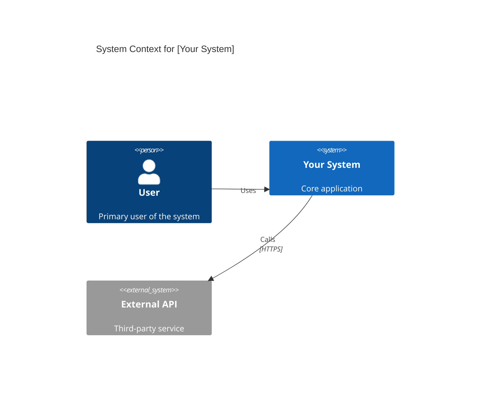
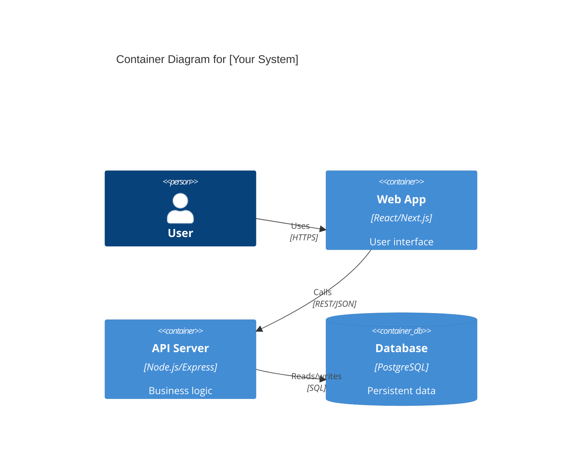
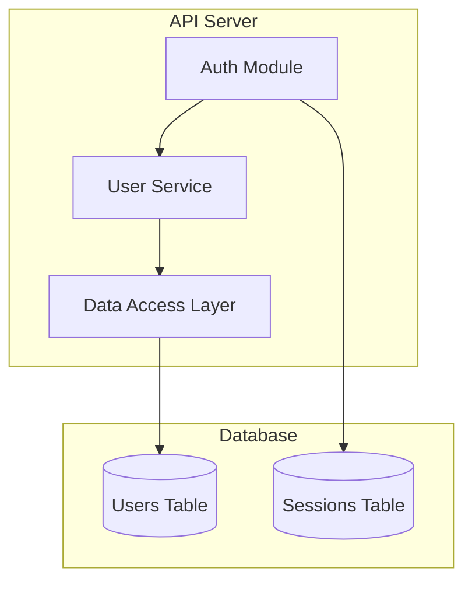
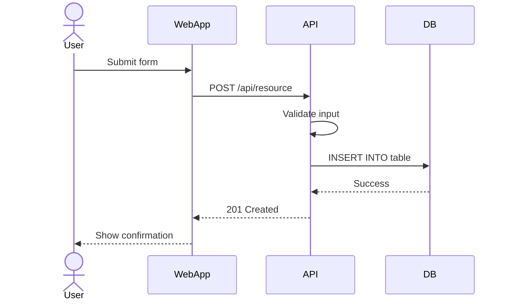
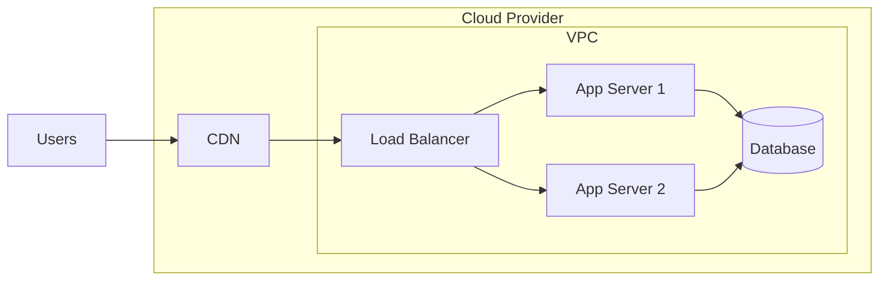

# Architecture Diagram: [COMPONENT NAME]

**Purpose**: Visual representation of [component/system/subsystem] architecture.

**Last updated**: YYYY-MM-DD

**Related specs**: `spec/TECH_SPEC.md`, ADR-####

---

## Context (C4 Level 1)

High-level system context showing external actors and systems.

---

## Container (C4 Level 2)

Major containers/deployable units and their interactions.

---

## Component (C4 Level 3)

Key components within a container and their responsibilities.

---

## Data Flow

Show how data flows through the system for key operations.

---

## Deployment

Infrastructure and deployment topology.

---

## Design Notes

### Key decisions
- Decision 1: rationale (link to ADR-#### if exists)
- Decision 2: rationale

### Constraints
- Constraint from `STACK.md` or `spec/NFR.md`

### Evolution
- Original design: brief description
- Changed on YYYY-MM-DD: what changed and why (link ADR if applicable)

---

## Related Resources
- Technical spec: `spec/TECH_SPEC.md#architecture`
- ADRs: ADR-0001, ADR-0003
- Features: F-0001, F-0005

